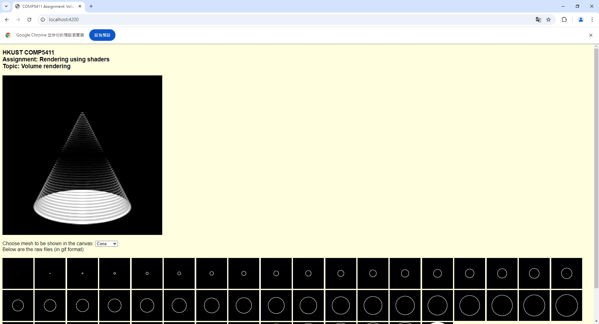

# Volume Rendering

## Overview

This Node.js application is designed to render a 3D object based on a set of cut-away view images using the Three.js library. By providing multiple cross-sectional images, the application reconstructs and visualizes the 3D object in a browser.

## Features

- **3D Object Rendering**: The application processes a set of cut-away view images and uses Three.js to render the corresponding 3D object
- **Three.js Integration**: Utilizes the powerful Three.js library for rendering 3D graphics and displaying them in a web-based environment

## Installation

1. Clone the repository:

   ```bash
   git clone <repository-url>
   cd <project-directory>
   ```

2. Install dependencies:

   ```bash
   npm install
   ```

3. Run the Node.js application:

   ```bash
   node app.js
   ```

4. Access the application in your browser:

   ```bash
   http://localhost:4200
   ```

## Demo



## Important Notes

- Ensure that the input images are properly aligned and represent consistent cross-sections of the object to get an accurate 3D rendering
- This application is designed for educational and basic 3D object visualization and may require further customization for more complex objects

## Disclaimer

This project is intended for educational and research purposes only. Users should ensure compliance with all applicable laws and regulations when utilizing this software.
